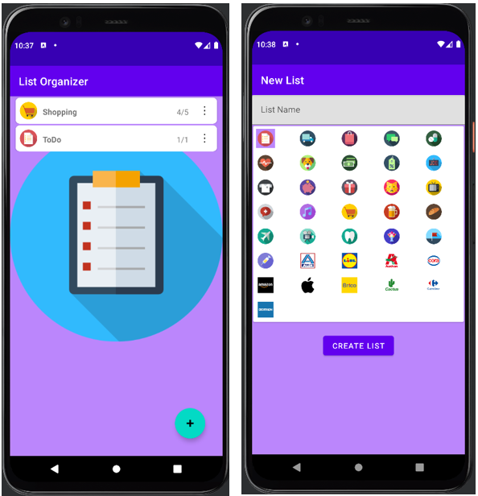

# List-Organizer (Android Application Analysis)

## Overview
The **List-Organizer** Android application is designed to help users manage (shopping) lists and their associated items. It supports adding, updating, and deleting shopping lists and items, with features like undo delete and real-time updates.

## Key Features

### 1. **Shopping List Management**
- Users can **create**, **edit**, and **delete** shopping lists.
- Lists can have **sublists**, allowing hierarchical organization.

### 2. **Item Management**
- Users can **add**, **update**, and **delete** items within a shopping list.
- Items have:
  - A **name**
  - A **description**
  - A **checkbox** to mark them as purchased

### 3. **Persistent Data Storage**
- Uses an SQLite database (`ListDb`) to store shopping lists and items persistently.
- DAO classes (`ListItemDao`) handle database operations.

### 4. **LiveData & ViewModel**
- `ItemActivityViewModel` manages data retrieval for shopping lists and items.
- **LiveData** ensures real-time UI updates when data changes.

### 5. **User Interaction**
- A **RecyclerView** displays shopping list items.
- Users can **expand/collapse descriptions** by tapping an item.
- A **popup menu** allows **editing** or **deleting** items.

### 6. **Undo Delete Feature**
- When an item is deleted, a **Snackbar** appears with an **UNDO** button.
- If not undone, the item is permanently deleted after a timeout.

### 7. **CRUD Operations**
- The app defines CRUD actions using an `enum` (`Crud`):
  - `CREATE` → Adding new items or lists
  - `UPDATE` → Editing existing items

### 8. **Request Codes**
- Managed via the `Request` class:
  - `CREATE_LIST_REQUEST` (20) → Creating a new list
  - `CREATE_ITEM_REQUEST` (30) → Creating a new item
  - `UPDATE_REQUEST` (40) → Updating an item

## Main Components

### **1. ItemActivity (Shopping List Screen)**
- Displays shopping lists and items using `RecyclerView`.
- Handles **adding** new items and lists.
- Provides options to **reset purchased items**.

### **2. ItemEditActivity (Item Editing Screen)**
- Allows users to **add** or **edit** items.
- Saves changes to the database.

### **3. ItemAdapter (RecyclerView Adapter)**
- Binds shopping list items to the UI.
- Handles **checkbox clicks** (marking items as purchased).
- Provides a **popup menu** for **editing** and **deleting** items.

### **4. ViewModel (ItemActivityViewModel)**
- Fetches shopping lists and items from the database.
- Uses **LiveData** to update the UI in real-time.

### **5. Extra.java (Constants)**
- Defines **keys** for passing data between activities (e.g., `LIST_ID`, `ITEM_ID`, `CRUD`).
